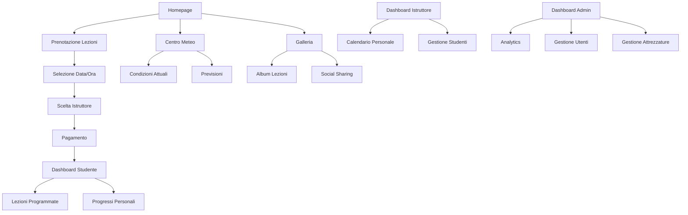

# PW Colombini L3 - Product Requirements Document

## 1. Product Overview

PW Colombini L3 è una piattaforma web completa per la gestione di una scuola di surf e longboard moderna, che digitalizza e ottimizza tutti i processi operativi dalla prenotazione delle lezioni alla gestione delle attrezzature.

La piattaforma risolve le problematiche di gestione manuale tipiche delle scuole di surf, offrendo un'esperienza utente fluida per studenti e istruttori, mentre fornisce agli amministratori strumenti avanzati per il controllo operativo e finanziario.

Il target principale include surfisti principianti e avanzati, famiglie in vacanza, e appassionati di sport acquatici che cercano un'esperienza di apprendimento professionale e ben organizzata.

## 2. Core Features

### 2.1 User Roles

| Ruolo | Metodo di Registrazione | Permessi Principali |
|-------|------------------------|---------------------|
| Studente | Registrazione email/social | Prenotare lezioni, visualizzare calendario, accedere a contenuti didattici, lasciare recensioni |
| Istruttore | Invito amministratore | Gestire calendario personale, visualizzare studenti assegnati, aggiornare condizioni meteo, caricare contenuti |
| Amministratore | Accesso diretto sistema | Controllo completo: gestione utenti, attrezzature, pagamenti, analytics, configurazioni |
| Gestore Attrezzature | Invito amministratore | Gestire inventario tavole/mute, assegnazioni, manutenzione, disponibilità |

### 2.2 Feature Module

La piattaforma PW Colombini L3 è composta dalle seguenti pagine principali:

1. **Homepage**: sezione hero con video surf, navigazione principale, panoramica servizi, condizioni meteo in tempo reale
2. **Prenotazione Lezioni**: calendario interattivo, selezione istruttore, scelta livello, gestione pagamenti
3. **Dashboard Studente**: lezioni prenotate, progressi, materiali didattici, storico pagamenti
4. **Dashboard Istruttore**: calendario personale, studenti assegnati, report lezioni, gestione disponibilità
5. **Gestione Attrezzature**: inventario tavole/mute, prenotazioni equipment, stato manutenzione
6. **Centro Meteo**: condizioni mare in tempo reale, previsioni, alert sicurezza, webcam spiaggia
7. **Galleria Multimediale**: foto/video lezioni, progressi studenti, eventi speciali, social sharing
8. **Sistema Recensioni**: valutazioni istruttori, feedback lezioni, testimonianze pubbliche
9. **Dashboard Amministrativa**: analytics completi, gestione utenti, configurazioni, report finanziari
10. **Profilo Utente**: informazioni personali, preferenze, storico attività, impostazioni notifiche

### 2.3 Page Details

| Nome Pagina | Nome Modulo | Descrizione Funzionalità |
|-------------|-------------|--------------------------|
| Homepage | Hero Section | Visualizza video promozionale surf, slogan scuola, call-to-action prenotazione immediata |
| Homepage | Condizioni Meteo | Mostra condizioni mare attuali, vento, temperatura, webcam live spiaggia |
| Homepage | Servizi Overview | Presenta tipologie lezioni, pacchetti disponibili, prezzi base, istruttori featured |
| Prenotazione Lezioni | Calendario Interattivo | Seleziona data/ora lezione, visualizza disponibilità istruttori, gestisce slot temporali |
| Prenotazione Lezioni | Selezione Servizi | Sceglie tipologia lezione (individuale/gruppo), livello difficoltà, durata, attrezzature incluse |
| Prenotazione Lezioni | Gateway Pagamento | Processa pagamenti sicuri, gestisce coupon/sconti, conferma prenotazione, invia ricevute |
| Dashboard Studente | Lezioni Programmate | Visualizza prossime lezioni, dettagli istruttore, location, possibilità cancellazione |
| Dashboard Studente | Progressi Personali | Traccia miglioramenti, obiettivi raggiunti, certificazioni ottenute, video progressi |
| Dashboard Studente | Materiali Didattici | Accede a video tutorial, guide tecniche, esercizi preparatori, teoria surf |
| Dashboard Istruttore | Calendario Personale | Gestisce disponibilità, visualizza lezioni assegnate, modifica orari, richiede sostituzioni |
| Dashboard Istruttore | Gestione Studenti | Visualizza profili studenti, aggiorna progressi, inserisce note lezioni, pianifica obiettivi |
| Dashboard Istruttore | Report Attività | Genera report lezioni svolte, ore lavorate, valutazioni ricevute, guadagni periodo |
| Gestione Attrezzature | Inventario Tavole | Gestisce catalogo tavole (shortboard/longboard), stato conservazione, assegnazioni |
| Gestione Attrezzature | Inventario Mute | Traccia mute disponibili per taglia, stagione, condizioni, prenotazioni |
| Gestione Attrezzature | Sistema Prenotazioni | Prenota attrezzature per lezioni, gestisce ritiri/consegne, calcola costi aggiuntivi |
| Centro Meteo | Condizioni Attuali | Mostra dati meteo real-time: onde, vento, temperatura, visibilità, maree |
| Centro Meteo | Previsioni Estese | Fornisce forecast 7 giorni, alert condizioni pericolose, consigli sicurezza |
| Centro Meteo | Webcam Live | Streaming live spiaggia, condizioni visive mare, archivio immagini giornaliere |
| Galleria Multimediale | Album Lezioni | Organizza foto/video per data, istruttore, studente, tipologia lezione |
| Galleria Multimediale | Progressi Studenti | Documenta evoluzione tecnica studenti, before/after, momenti salienti |
| Galleria Multimediale | Social Sharing | Condivide contenuti su social media, genera hashtag automatici, privacy controls |
| Sistema Recensioni | Valutazioni Istruttori | Raccoglie feedback studenti, rating stelle, commenti dettagliati, moderazione |
| Sistema Recensioni | Feedback Lezioni | Valuta qualità singole lezioni, suggerimenti miglioramento, segnalazioni problemi |
| Sistema Recensioni | Testimonianze Pubbliche | Pubblica recensioni positive, gestisce approvazioni, showcase homepage |
| Dashboard Amministrativa | Analytics Avanzati | Monitora KPI business, trend prenotazioni, performance istruttori, revenue analysis |
| Dashboard Amministrativa | Gestione Utenti | Amministra account studenti/istruttori, permessi, sospensioni, comunicazioni di massa |
| Dashboard Amministrativa | Configurazioni Sistema | Imposta prezzi, orari operativi, politiche cancellazione, integrazioni esterne |
| Profilo Utente | Informazioni Personali | Gestisce dati anagrafici, contatti, preferenze comunicazione, foto profilo |
| Profilo Utente | Storico Attività | Visualizza cronologia lezioni, pagamenti, progressi, certificazioni conseguite |
| Profilo Utente | Impostazioni Privacy | Controlla visibilità profilo, condivisione dati, notifiche push, consensi marketing |

## 3. Core Process

### Flusso Studente Principale
Lo studente accede alla homepage, visualizza le condizioni meteo attuali e naviga verso la sezione prenotazioni. Seleziona data e ora desiderata dal calendario interattivo, sceglie il tipo di lezione (individuale o gruppo) e il livello di difficoltà. Il sistema mostra gli istruttori disponibili con le loro specializzazioni. Dopo aver selezionato l'istruttore, può aggiungere attrezzature extra se necessario. Procede al pagamento tramite gateway sicuro e riceve conferma immediata via email con tutti i dettagli della lezione.

### Flusso Istruttore Operativo
L'istruttore accede alla sua dashboard personale e visualizza il calendario delle lezioni assegnate. Prima di ogni lezione, controlla le condizioni meteo e può suggerire modifiche se necessario. Durante la lezione, può scattare foto/video per documentare i progressi dello studente. Al termine, inserisce note sulla performance e aggiorna il profilo progressi dello studente. Può anche gestire la sua disponibilità futura e richiedere sostituzioni se necessario.

### Flusso Amministratore Gestionale
L'amministratore monitora quotidianamente le prenotazioni attraverso la dashboard analytics. Gestisce l'assegnazione degli istruttori ottimizzando il carico di lavoro. Controlla l'inventario delle attrezzature e pianifica manutenzioni. Analizza i report finanziari e le performance degli istruttori. Risponde alle recensioni e gestisce eventuali reclami. Aggiorna prezzi e promozioni in base alla stagionalità.

## 4. User Interface Design

### 4.1 Design Style

**Colori Principali:**
- Primario: Blu oceano (#0077BE) per header, CTA principali, link attivi
- Secondario: Turchese (#20B2AA) per accenti, hover states, notifiche positive
- Neutri: Bianco (#FFFFFF), Grigio chiaro (#F8F9FA), Grigio scuro (#343A40)

**Stile Pulsanti:**
- Pulsanti primari: arrotondati (border-radius: 8px), effetto hover con elevazione
- Pulsanti secondari: outline style con bordo colorato
- CTA principali: dimensioni generose (min 48px altezza) per touch-friendly

**Tipografia:**
- Font principale: Inter o Roboto per leggibilità ottimale
- Titoli: 24-32px, peso semi-bold
- Testo corpo: 16px, peso regular, line-height 1.5
- Testo piccolo: 14px per metadati e note

**Layout Style:**
- Design card-based per contenuti modulari
- Navigazione top con mega-menu per desktop
- Sidebar collassabile per dashboard
- Grid system responsive 12-colonne

**Icone e Emoji:**
- Set icone coerente (Feather Icons o Heroicons)
- Emoji surf-themed: 🏄‍♂️ 🌊 ☀️ 🏖️ per elementi ludici
- Icone meteo animate per condizioni live

### 4.2 Page Design Overview

| Nome Pagina | Nome Modulo | Elementi UI |
|-------------|-------------|-------------|
| Homepage | Hero Section | Video background fullscreen, overlay gradiente blu, titolo bianco bold 48px, CTA button arancione prominente |
| Homepage | Condizioni Meteo | Card compatta angolo superiore destro, icone meteo animate, testo bianco su sfondo semi-trasparente |
| Prenotazione Lezioni | Calendario | Grid calendario pulito, giorni disponibili evidenziati in turchese, hover effects, modal per dettagli slot |
| Dashboard Studente | Lezioni Programmate | Lista card verticale, ogni lezione con foto istruttore, badge livello, countdown timer |
| Centro Meteo | Condizioni Attuali | Dashboard stile weather app, grafici onde, indicatori circolari vento, palette blu-verde |
| Gestione Attrezzature | Inventario | Griglia prodotti con immagini, badge disponibilità, filtri laterali, search bar prominente |
| Galleria | Album Lezioni | Masonry layout responsive, lightbox per zoom, filtri tag, infinite scroll |
| Dashboard Admin | Analytics | Grafici colorati, KPI cards con icone, tabelle data sortable, export buttons |

### 4.3 Responsiveness

La piattaforma segue un approccio mobile-first con breakpoints standard:
- Mobile: 320-768px (stack verticale, menu hamburger, touch-optimized)
- Tablet: 768-1024px (layout ibrido, sidebar collassabile)
- Desktop: 1024px+ (layout completo, hover states, multi-colonna)

Ottimizzazioni touch specifiche per mobile: pulsanti min 44px, swipe gestures per gallerie, pull-to-refresh per dashboard, navigazione bottom-tab per sezioni principali.